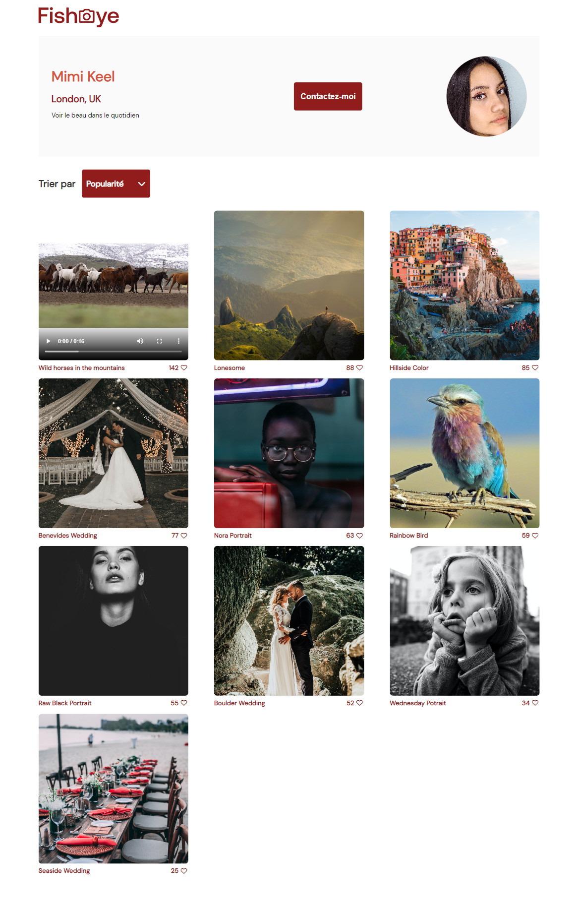

  

<h1 align="center" style="margin-top: 0px;">Projet 6</h1>

## Entreprise :
Site web de photographes freelances. “Nos clients prennent de super photos, mais ils n’y connaissent rien en développement web. C'est pourquoi nous proposons une plateforme unique pour montrer leurs photos sur une belle page et les contacter pour des événements ou des tirages. Nous sommes l'un des plus grands sites de photographie en freelance, avec un énorme réseau de photographes.”
## Objectif :
Leur site est obsolète et a besoin d'être remanié. "Notre site a été construit il y a plus de dix ans, et nous n'avons pas eu l'occasion de le mettre à jour jusqu'à présent. Nous venons de lever des fonds et nous aimerions  que votre équipe le transforme d'un site statique à un site dynamique".
- [Le repo forké servant de base](https://github.com/OpenClassrooms-Student-Center/GameOn-website-FR/).
- [Le site visible ici](https://christophervrel.github.io/Fisheye/).
## Prototype des fonctionnalités : 
Nous devons créer les pages suivantes pour le prototype :
### 🟥 Page d'accueil :
- Liste de tous les photographes avec leur nom, leur slogan, leur localisation, leur prix/heure et une image miniature de leur choix.
- Lorsque l'utilisateur clique sur la vignette d'un photographe, il est amené à sa page.
### 🟥 Page des photographes
(le contenu de la page sera généré de manière dynamique en fonction du photographe) :
- Affiche une galerie des travaux du photographe.
- Les photographes peuvent montrer à la fois des photos et des vidéos.
  - Dans le cas des vidéos, montrer une image miniature dans la galerie.
- Chaque média comprend un titre et un nombre de likes.
  - Lorsque l'utilisateur clique sur l'icône "Like", le nombre de likes
affiché est incrémenté.
#### ■ Le nombre de likes total d’un photographe doit correspondre à la somme des likes de chacun de ses médias.
- Les médias peuvent être triés par popularité ou par titre.
- Lorsque l'utilisateur clique sur un média, celui-ci doit s’ouvrir dans une lightbox :
  - Lorsque la lightbox est affichée, il y a une croix dans le coin pour fermer la fenêtre.
  - Des boutons de navigation permettent de passer d'un élément média à l'autre dans la lightbox (les utilisateurs peuvent cliquer sur ces boutons pour naviguer).
#### ■ Les touches fléchées du clavier permettent également de naviguer entre les médias dans la lightbox.
#### ■ Afficher un bouton pour contacter le photographe.
- Le formulaire de contact est une modale qui s'affiche par-dessus le reste.
- Il comprend des champs pour les noms, l'adresse électronique et le message.
- Plus tard, le bouton de contact enverra un message au photographe. Pour l'instant, seulement afficher le contenu des trois champs dans les logs de la console.
### 🟥 Responsive design
“Pour cette itération, pas besoin que le site soit responsive sur mobile.”
### 🟥 L'accessibilité est clé !
"Il est très important que notre site soit accessible aux utilisateurs malvoyants. Toutes nos photos doivent comporter des descriptions textuelles, et vous devez les inclure dans la page. De plus, l'utilisateur doit pouvoir utiliser les commandes du clavier pour naviguer sur le site, comme les touches fléchées de la lightbox".
- Utilisez des éléments HTML "sémantiques" qui décrivent leur intention autant que possible, au lieu de mettre des éléments 
 et  partout.
- Lorsque vous devez créer un élément personnalisé, ajoutez des attributs ARIA pour décrire ce qu'il fait.
- Les images doivent présenter un attribut “alt”. Utilisez le titre des photos pour remplir cet attribut, et le nom du photographe dans le cas d’une photo de profil de photographe.
- Le code devrait passer les tests AChecker sans “known issue” (afin qu'il soit conforme aux WCAG).
- Toute la gestion des événements (par exemple, les clics et les pressions au clavier) doit être configurée (utilisez KeyboardEvent.key ou KeyboardEvent.code.).
- Utilisez un lecteur d'écran gratuit pour vous faire une idée de ce que représente l'utilisation du site pour une personne malvoyante.
### 🟥 Contraintes techniques additionnelles
- Le code est séparé en différents fichiers (HTML, CSS, JavaScript).
- ESLint est utilisé (avec les paramètres par défaut) pour garantir que le code est robuste. Ceci est particulièrement facile à intégrer avec l'IDE VSCode.
- Une version moderne (ES6 ou supérieure) de JavaScript est utilisée et les fonctionnalités obsolètes ne sont pas utilisées.
- Le code est lisible. Il faudra s'assurer que les variables et fonctions ont un nom qui ont un sens, et commenter le code lorsque le nom n'indique pas explicitement ce qu'il se passe.